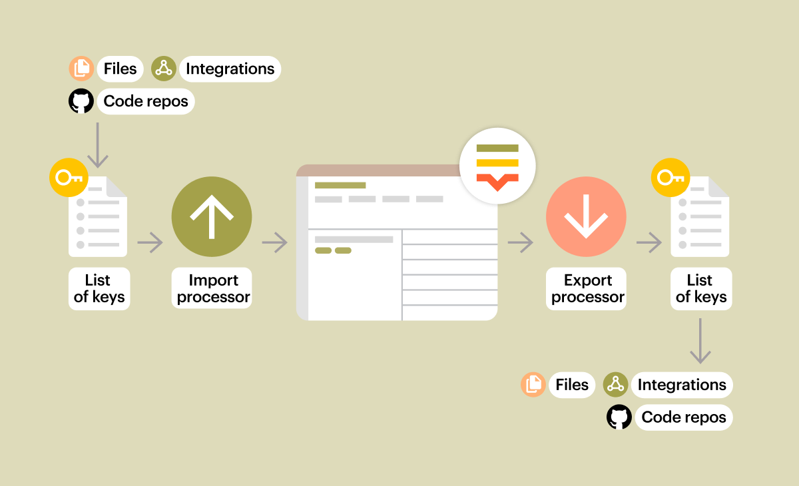

# Lokalise custom processor demo app
This is a simple app to process warning(⚠️) emoji before and after translation. 

## Configuration
**Import Custom processor URL**: `https://lokalise-custom-processor-demo.vercel.app/api/preprocess`
**Export Custom processor URL** `https://lokalise-custom-processor-demo.vercel.app/api/postprocess`

For more details about the custom processor take a look at [here](https://developers.lokalise.com/docs/custom-processor).